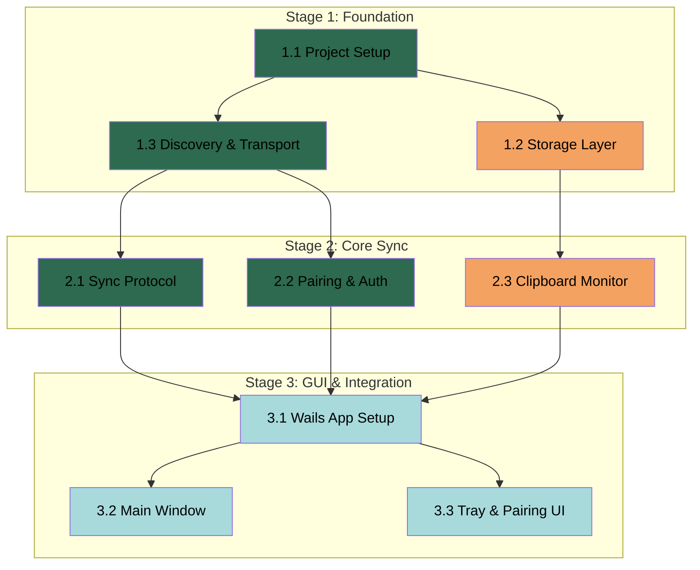

# APM Plan

## Workers

| Worker | Domain | Description |
|--------|--------|-------------|
| Network Agent | Network | P2P networking, mDNS device discovery, TLS encrypted transport, sync protocol, pairing mechanism |
| Clipboard Agent | Clipboard & Storage | Clipboard monitoring (system events + polling), content capture, SQLite storage, history management, LRU eviction |
| GUI Agent | User Interface | Wails desktop application, main window with history/search, system tray, device pairing UI |

## Stages

| Stage | Name | Tasks | Agents |
|-------|------|-------|--------|
| 1 | Foundation | 3 | Network, Clipboard |
| 2 | Core Sync | 3 | Network, Clipboard |
| 3 | GUI & Integration | 3 | GUI |

## Dependency Graph

---

> **Notes:**
> - Stage 1 tasks 1.1 and 1.2 can proceed in parallel (different Workers, no dependency).
> - Task 1.3 depends on 1.1 (project must exist before adding network code).
> - Stage 2 tasks 2.1 and 2.2 can proceed in parallel (both depend on 1.3, but independent of each other).
> - Task 2.3 depends on 1.2 (storage layer must exist for history writes).
> - Stage 3 is sequential — app setup first, then window and tray can be parallel.
> - Critical path: 1.1 → 1.3 → 2.1 → 3.1 → 3.2/3.3
> - The Network Agent carries the heaviest workload (4 tasks). This is appropriate — the network layer is the most complex and interconnected part of the system.
> - Cross-compilation (CGO for SQLite, platform-specific clipboard APIs) should be validated early in Stage 1.

## Stage 1: Foundation

### Task 1.1: Project Setup - Network Agent

* **Objective:** Initialize the Go project with module structure, dependencies, and basic project scaffolding.
* **Output:** Go module with directory structure, `go.mod` with dependencies, Makefile or build script for cross-compilation (macOS/Windows).
* **Validation:** `go build` succeeds on the current platform; project structure is clean and conventional.
* **Guidance:**
  - Initialize Go module (e.g., `github.com/user/clipboardsync` or similar).
  - Set up directory structure: `cmd/` (main entry), `internal/` (core packages), `pkg/` (shared interfaces).
  - Key dependencies to add: mDNS library, SQLite driver (go-sqlite3 with CGO), TLS utilities.
  - Create a cross-compilation build script that targets both `darwin/amd64` and `windows/amd64`.
  - CGO is required for SQLite — ensure build script handles CGO_ENABLED=1 and cross-compilation toolchain.
  - Add a `.gitignore` for Go projects.
* **Dependencies:** None

1. Initialize Go module with `go mod init`.
2. Create directory structure: `cmd/clipboardsync/`, `internal/network/`, `internal/clipboard/`, `internal/storage/`, `internal/pairing/`, `internal/gui/`, `pkg/models/`, `pkg/api/`.
3. Add dependencies: `github.com/mattn/go-sqlite3`, mDNS library (e.g., `github.com/hashicorp/mdns` or `github.com/grandcat/zeroconf`), and any TLS/crypto packages needed.
4. Create `cmd/clipboardsync/main.go` with a basic entry point.
5. Create a build script (`Makefile` or shell script) for cross-compilation targeting macOS and Windows.
6. Initialize git repository.
7. Verify `go build` succeeds.

### Task 1.2: Storage Layer - Clipboard Agent

* **Objective:** Implement the SQLite storage layer for clipboard history with LRU eviction and search.
* **Output:** `internal/storage/` package with database initialization, CRUD operations for clipboard entries, LRU eviction logic, and search functionality.
* **Validation:** Unit tests pass for all storage operations (insert, query, search, delete, LRU eviction). Database file is created correctly. Eviction removes oldest entries when limit is reached.
* **Guidance:**
  - Refer to Spec "Data Model" section for clipboard entry schema.
  - Use `github.com/mattn/go-sqlite3` (CGO-based SQLite driver).
  - Schema: `clipboard_entries` table with columns: `id` (TEXT PRIMARY KEY), `content_type` (TEXT), `content_hash` (TEXT, indexed), `payload` (TEXT/BLOB), `source_device` (TEXT), `timestamp` (INTEGER), `size` (INTEGER).
  - `devices` table: `id` (TEXT PRIMARY KEY), `display_name` (TEXT), `paired` (BOOLEAN), `last_seen` (INTEGER), `public_key` (BLOB).
  - LRU eviction: after each insert, if total entries exceed configured max (default 1000), delete oldest entries by timestamp until within limit.
  - Search: `SELECT ... WHERE payload LIKE ?` for text entries. No full-text search needed for MVP.
  - Content hash (SHA-256) for deduplication: before insert, check if hash already exists.
  - Expose a clean Go interface: `Store`, `Get`, `Search`, `Delete`, `Evict`, `List`.
* **Dependencies:** None

1. Design and create SQLite schema (CREATE TABLE statements).
2. Implement `internal/storage/database.go` — database initialization, migration, connection management.
3. Implement `internal/storage/clipboard.go` — CRUD operations for clipboard entries.
4. Implement `internal/storage/device.go` — device record operations.
5. Implement `internal/storage/eviction.go` — LRU eviction logic.
6. Implement `internal/storage/search.go` — text search across entries.
7. Write unit tests for all storage operations.
8. Verify tests pass with `go test ./internal/storage/...`.

### Task 1.3: Discovery & Transport - Network Agent

* **Objective:** Implement mDNS-based device discovery and TLS-encrypted transport layer.
* **Output:** `internal/network/` package with mDNS service advertising/discovery, TLS server/client, and connection management.
* **Validation:** Two instances on the same LAN can discover each other via mDNS. TLS handshake succeeds. Basic message can be sent and received between two instances.
* **Guidance:**
  - mDNS: Advertise a service type (e.g., `_clipboardsync._tcp`) on a configurable port. Browse for the same service to discover peers.
  - Use a Go mDNS library (e.g., `github.com/grandcat/zeroconf`).
  - TLS: Generate self-signed certificates per device (stored locally). Use TLS 1.3 minimum.
  - Connection manager: maintain a map of connected peers (device ID → connection). Handle connect/disconnect events.
  - Message framing: define a simple binary or JSON message format for control and data messages. Include message type, length, and payload.
  - Keep the transport layer generic — it should support sending arbitrary messages to any connected peer.
* **Dependencies:** Task 1.1

1. Implement mDNS service advertising in `internal/network/discovery.go`.
2. Implement mDNS service browsing for peer discovery.
3. Implement TLS certificate generation and storage in `internal/network/tls.go`.
4. Implement TLS server (listen for incoming connections) and TLS client (connect to discovered peers).
5. Implement connection manager in `internal/network/connection.go` — track connected peers, handle lifecycle.
6. Define message format and implement message serialization/deserialization in `internal/network/message.go`.
7. Write integration test: start two instances, discover each other, establish TLS connection, exchange a test message.
8. Verify test passes.

## Stage 2: Core Sync

### Task 2.1: Sync Protocol - Network Agent

* **Objective:** Implement the clipboard synchronization protocol — push updates to peers, receive and store incoming entries.
* **Output:** `internal/network/sync.go` with sync protocol logic: push new clipboard entries to all connected peers, receive incoming entries, handle deduplication by content hash, preserve all versions on conflict.
* **Validation:** When two instances are connected and one pushes a clipboard entry, the other receives and stores it. Duplicate content (same hash) is not stored twice. Simultaneous different entries from multiple devices are all preserved.
* **Guidance:**
  - Refer to Spec "Sync Protocol" section for design.
  - Push model: on clipboard change (from Task 2.3), broadcast entry to all connected peers.
  - On receipt: check content hash against local storage. If exists, skip insert (dedup). If new, store locally.
  - Message types needed: `SyncEntry` (push new entry), `AckEntry` (acknowledge receipt), `RequestHistory` (initial sync on connect — optional for MVP).
  - File transfer: for entries > text threshold (images, files), send content in chunks with a header indicating type, size, and hash. Respect 50MB limit.
  - Error handling: if a peer is unreachable, remove from active connections. Retry is handled by reconnection logic (mDNS rediscovery).
* **Dependencies:** **Task 1.2 by Clipboard Agent** (storage layer), Task 1.3

1. Define sync protocol message types (SyncEntry, AckEntry, RequestHistory).
2. Implement broadcast logic — send message to all connected peers.
3. Implement receive handler — process incoming SyncEntry, check hash, store if new.
4. Implement chunked transfer for large entries (images, files).
5. Integrate with connection manager from Task 1.3 — handle peer connect/disconnect events.
6. Write integration test: two instances, push text entry, verify receipt and storage. Push duplicate, verify dedup.
7. Verify tests pass.

### Task 2.2: Pairing & Authentication - Network Agent

* **Objective:** Implement the 6-digit pairing code mechanism and persistent device authentication.
* **Output:** `internal/pairing/` package with pairing code generation, validation, cryptographic key exchange, and persistent trust storage.
* **Validation:** Device A generates a 6-digit code. Device B enters the code. Pairing succeeds within 60 seconds. After pairing, devices can authenticate without re-entering code. Expired codes are rejected. Unpaired devices cannot connect.
* **Guidance:**
  - Refer to Spec "Security Model" section.
  - Pairing flow: Device A generates a random 6-digit code and starts listening. Device B enters the code and connects. Both devices perform a key exchange (e.g., Diffie-Hellman or Ed25519 key pairs). Store the peer's public key in the `devices` table.
  - After pairing, future connections authenticate by verifying the stored public key (challenge-response or signature verification).
  - Code expiry: 60 seconds. After expiry, the code is invalid and must be regenerated.
  - The pairing UI (Task 3.3) will call into this package — expose clean functions: `GenerateCode()`, `PairWithCode(code)`, `IsDevicePaired(deviceID)`, `GetPairedDevices()`.
* **Dependencies:** Task 1.3, **Task 1.2 by Clipboard Agent** (device storage)

1. Implement pairing code generation (6-digit random, 60-second expiry) in `internal/pairing/code.go`.
2. Implement key pair generation (Ed25519) per device in `internal/pairing/crypto.go`.
3. Implement pairing protocol — code exchange, key exchange, trust establishment.
4. Implement persistent authentication — store peer public keys, verify on reconnect.
5. Integrate with connection manager — reject connections from unpaired devices.
6. Write unit tests for pairing flow, code expiry, and authentication.
7. Verify tests pass.

### Task 2.3: Clipboard Monitor - Clipboard Agent

* **Objective:** Implement cross-platform clipboard monitoring with system events and polling fallback, plus content capture.
* **Output:** `internal/clipboard/` package with clipboard watcher (event-driven + 1000ms polling fallback), content capture (text, image, file detection), and change notification.
* **Validation:** Clipboard changes are detected within 500ms (event) or 1000ms (polling). Content type is correctly identified. Hash-based deduplication prevents duplicate notifications for unchanged content. Resource usage is minimal when idle.
* **Guidance:**
  - Platform-specific: macOS uses `NSPasteboard` changeCount for polling (CGO or syscall). Windows uses `AddClipboardFormatListener` or polling via Win32 API.
  - For MVP, polling with hash comparison is acceptable on both platforms. System event hooks can be added as an optimization.
  - Content capture: read clipboard content, compute SHA-256 hash, compare with last known hash. If different, capture the new content.
  - Type detection: check clipboard format types — plain text, PNG/TIFF (image), file path list.
  - Expose a Go channel or callback: when clipboard changes, emit a `ClipboardEvent{Type, Content, Hash, Size}`.
  - Integrate with storage (Task 1.2) — automatically store new entries.
  - Integrate with sync (Task 2.1) — trigger push to peers on change.
  - Resource efficiency: when no peers connected, reduce polling frequency or pause.
* **Dependencies:** **Task 1.2 by Clipboard Agent** (storage layer), Task 2.1 (for triggering sync)

1. Implement clipboard polling for macOS (`internal/clipboard/darwin.go`) — read pasteboard changeCount, capture content.
2. Implement clipboard polling for Windows (`internal/clipboard/windows.go`) — read clipboard, detect changes.
3. Implement content type detection and hash computation in `internal/clipboard/capture.go`.
4. Implement watcher logic in `internal/clipboard/watcher.go` — start/stop watching, emit events on change.
5. Integrate with storage — auto-store new entries.
6. Integrate with sync protocol — trigger peer broadcast on change.
7. Write unit tests for hash computation, type detection, deduplication.
8. Verify tests pass.

## Stage 3: GUI & Integration

### Task 3.1: Wails App Setup - GUI Agent

* **Objective:** Set up the Wails v2 application framework with Go backend bindings and web frontend scaffolding.
* **Output:** Wails project structure with `main.go`, frontend directory (HTML/CSS/JS), Go backend exposed as bindings to the frontend, and a running window that displays.
* **Validation:** `wails dev` launches a native window displaying a basic UI. `wails build` produces a standalone executable. Go backend functions are callable from the frontend.
* **Guidance:**
  - Use Wails v2 (`wails.io`). Install Wails CLI if needed.
  - Project structure: `cmd/clipboardsync/` for the Wails app entry, `frontend/` for web assets.
  - Expose backend services to frontend via Wails bindings: storage (search, list, delete), network (connect, pair, device list), clipboard (toggle sync).
  - Frontend: use vanilla HTML/CSS/JS or a lightweight framework (e.g., Preact, Alpine.js) — keep it simple.
  - Ensure the app builds as a single executable with no external dependencies.
  - Cross-compilation: Wails supports cross-compilation — validate both macOS and Windows builds.
* **Dependencies:** **Task 2.1 by Network Agent** (sync protocol), **Task 2.2 by Network Agent** (pairing), **Task 2.3 by Clipboard Agent** (clipboard monitor)

1. Initialize Wails project with `wails init`.
2. Set up Go backend struct that wraps all services (storage, network, clipboard, pairing).
3. Expose backend methods as Wails bindings.
4. Create frontend scaffold with basic HTML structure and CSS styling.
5. Verify `wails dev` launches and displays the window.
6. Verify `wails build` produces a working executable.
7. Test cross-compilation for Windows.

### Task 3.2: Main Window - GUI Agent

* **Objective:** Implement the main application window with clipboard history list, search bar, and entry actions.
* **Output:** Frontend implementation of the history view: scrollable list, search functionality, entry preview (text/image/file), copy-to-clipboard action, delete action.
* **Validation:** History entries are displayed in a scrollable list. Search filters entries in real-time. Clicking an entry copies it back to clipboard. Entries show correct preview based on type. Delete removes entries from history.
* **Guidance:**
  - Use the backend bindings from Task 3.1 to fetch and display history.
  - Entry display: text entries show a snippet (first 200 chars), image entries show a thumbnail, file entries show name and size.
  - Search: debounced input, queries backend search function, updates list in real-time.
  - Virtual scrolling or pagination if list performance is a concern with 1000 entries.
  - Styling: clean, minimal design. Dark/light mode support is a nice-to-have.
  - Keyboard shortcuts: Cmd/Ctrl+F for search focus, Escape to clear.
* **Dependencies:** Task 3.1

1. Implement history list component with scrollable container.
2. Implement entry rendering by type (text preview, image thumbnail, file info).
3. Implement search bar with debounced input and real-time filtering.
4. Implement copy-to-clipboard action on entry click.
5. Implement delete action on entries.
6. Add keyboard shortcuts.
7. Style the UI — clean, readable, responsive to window resize.
8. Test with populated history data.

### Task 3.3: Tray & Pairing UI - GUI Agent

* **Objective:** Implement system tray integration, sync toggle, device list view, and pairing UI.
* **Output:** System tray icon with menu, device management panel in main window, pairing code generation and entry UI.
* **Validation:** Tray icon appears in system tray/menu bar. Tray menu items work (open window, toggle sync, view devices, clear history, quit). Pairing code is displayed and can be entered on another device. Device list shows paired devices with status. Toggle sync on/off works.
* **Guidance:**
  - Wails supports system tray natively — use `wails.Options` to configure tray.
  - Tray menu: Open (shows window), Sync On/Off (toggles clipboard monitoring), Devices (opens device panel), Clear History (confirms then clears), Quit.
  - Device panel: list of paired devices (name, status, last seen), "Pair New Device" button.
  - Pairing UI: modal or panel showing generated 6-digit code (large, easy to read), input field for entering code from another device, status feedback (success/failure/timeout).
  - Status indicators: tray icon changes based on state (syncing, paused, disconnected).
* **Dependencies:** Task 3.1

1. Implement system tray with icon and menu items.
2. Implement tray menu actions (open window, toggle sync, clear history, quit).
3. Implement device list panel in the main window.
4. Implement "Generate Pairing Code" UI — display code prominently.
5. Implement "Enter Pairing Code" UI — input field with validation and feedback.
6. Implement sync toggle — pause/resume clipboard monitoring via backend binding.
7. Add confirmation dialog for destructive actions (clear history).
8. Test all tray and pairing flows.
